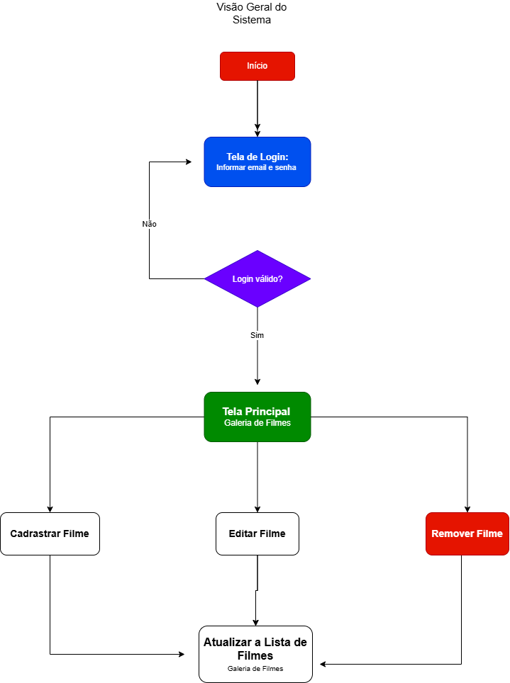
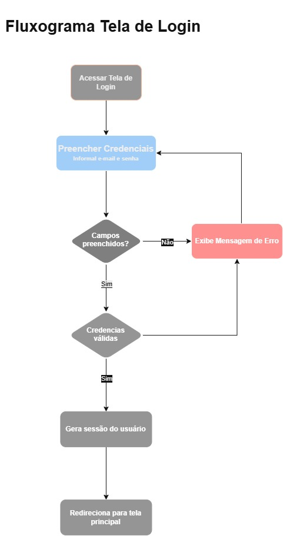
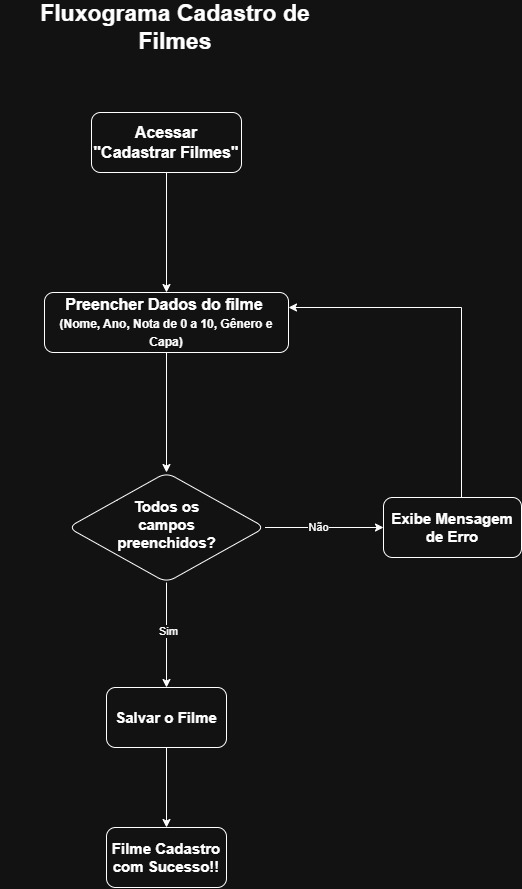

# Projeto Catálogo de Filmes

**Nome do Projeto**: Catálogo de Filmes  
**Equipe de Desenvolvimento**: Mayara Caetano

## 1. Visão Geral do Sistema (Escopo)

O **Catálogo Pessoal de Filmes** será um sistema para ajudar o usuário a organizar seus filmes em um só lugar. A ideia é substituir a planilha que ele usa atualmente por um sistema mais organizado e visual, onde seja possível colocar as capas dos filmes.

## 2. Requisitos Funcionais (RF)

**RF01**: O sistema deve permitir que o usuário realize login utilizando seu usuário e senha.

**RF02**: O sistema deve permitir que o usuário cadastre um novo filme, contendo:

-   Nome do filme
-   Ano de lançamento
-   Gênero
-   Nota de 0 a 10
-   Imagem da capa

**RF03**: O sistema deve permitir que o usuário visualize sua coleção de filmes cadastrados com suas respectivas capas.

**RF04**: O sistema deve permitir que o usuário visualize as informações de um filme cadastrado.

**RF05**: O sistema deve permitir que o usuário edite as informações de um filme já cadastrado.

**RF06**: O sistema deve permitir que o usuário altere a nota de um filme cadastrado.

**RF07**: O sistema deve permitir que o usuário altere a imagem da capa de um filme cadastrado.

**RF08**: O sistema deve permitir que o usuário exclua um filme da sua coleção.

**RF09**: O sistema deve permitir que o usuário encerre sua sessão por meio da opção de logout.

## 3. Requisitos Não Funcionais (RNF)

**RNF01**: O sistema deve garantir que a coleção de filmes seja acessível somente pelo usuário autenticado.

**RNF02**: O sistema deve possuir uma interface simples  para facilitar o cadastro e o gerenciamento dos filmes.

**RNF03**: O sistema deve apresentar as informações dos filmes de forma organizada e visual.

**RNF04**: O sistema deve armazenar as informações cadastradas de forma persistente, evitando a perda dos dados após o encerramento do sistema.

**RNF05**: O sistema deve apresentar um tempo de resposta adequado durante as operações de cadastro, edição, consulta e exclusão dos filmes.

**RNF06**: O sistema deve permitir o armazenamento das imagens utilizadas como capas dos filmes.

## 4. Regras de Negócio (RN)

**RN01**: O usuário deve estar autenticado para acessar e gerenciar sua coleção de filmes.

**RN02**: A nota atribuída a um filme deve estar entre 0 e 10.

**RN03**: Cada filme cadastrado deve possuir nome, ano de lançamento, gênero, nota e capa.

**RN04**: O usuário poderá editar as informações dos filmes que já estiverem cadastrados.

**RN05**: O usuário poderá excluir filmes de sua coleção quando desejar.

**RN06**: A coleção de filmes deve ser de uso pessoal, não sendo compartilhada com outros usuários nesta versão do sistema.

## Visão Geral (Diagrama)

## Visão Página de Login (Diagrama)

## Visão Cadastro de Filmes (Diagrama)
